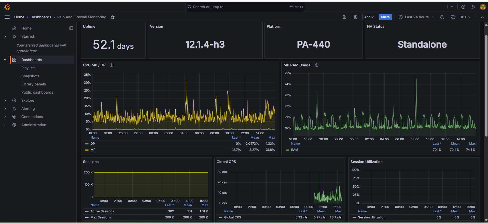

# Firewall Monitoring Starter

Palo Alto and Fortinet firewall monitoring stack with Docker Compose, Telegraf, InfluxDB, and Grafana. SNMP is the baseline; Palo Alto devices can optionally add read-only PAN-OS XML API performance polling.



The goal is simple operational visibility: CPU, memory, sessions, CPS, disk where useful, interface status, errors/discards, and throughput. It is useful when you need a quick factual view of firewall load without deploying a full NMS.

The standard Palo Alto and Fortinet dashboards calculate throughput from IF-MIB interface counters (`ifHCInOctets` and `ifHCOutOctets`). The optional API-only Palo Alto dashboards instead use the hardware interface byte counters returned by `show counter interface all`. Neither path uses session or feature throughput summaries, which can miss offloaded traffic.

## What You Get

- InfluxDB 2.7 for time series storage, published on `127.0.0.1:8086` only
- Grafana 13.2.2 with a provisioned InfluxDB (Flux) datasource
- A custom Telegraf 1.40.1 (Alpine) image with Net-SNMP, the standard and vendor MIBs, and the Palo Alto API collector
- Telegraf SNMP polling generated from `firewalls.yml`, split into a 20-second instance for load data and a 60-second instance for slow-moving tables
- Optional Palo Alto XML API polling for sessions, management-plane resources, per-core dataplane CPU, ingress backlogs, interface state and throughput, HA, storage, environmental sensors, logging and management health, and selected drop counters
- Five provisioned dashboards:
  - `Palo Alto Firewall Monitoring`
  - `Palo Alto Chassis Monitoring`
  - `Fortinet Firewall Monitoring`
  - `Palo Alto API Performance Monitoring`
  - `Palo Alto API Chassis Monitoring`
- Best-effort SNMP discovery of model, software version, and features before the Telegraf configuration is generated

## Common Tasks

- [Install on a fresh Ubuntu host](#install-on-ubuntu)
- [Install or regenerate the stack](#quick-start)
- [Open Grafana and view a dashboard](#open-grafana-and-view-dashboards)
- [Write `firewalls.yml` step by step](#write-firewallsyml-step-by-step)
- [Declare firewalls and their options](#firewall-inventory)
- [Configure Palo Alto XML API monitoring](#palo-alto-xml-api-setup)
- [Generate a Palo Alto API key and choose where it is stored](#generate-a-key-with-paloalto_api_keypy)
- [Upgrade from v1.0.2 (SNMP-only, May 2026)](#upgrade-from-v102-snmp-only-may-2026)
- [Upgrade from v1.1.0](#upgrade-from-v110)
- [Upgrade from v1.2.0](#upgrade-from-v120)
- [Upgrade from v1.3.0](#upgrade-from-v130)
- [Upgrade any other installation](#upgrade-an-existing-installation)

## Requirements

- Linux host with Docker and Docker Compose v2.24 or later (the Telegraf service uses an optional `env_file` entry)
- Python 3 with `venv` and `pip`
- UDP/161 reachable from the Docker host to each firewall
- For optional Palo Alto API monitoring, TCP/443 (or the configured API port) reachable from the Telegraf container
- SNMP enabled on the firewall management interface or the interface you poll
- Outbound HTTPS from the Docker host during installation (container images, Python packages, Palo Alto MIB archives)
- A local `.env` file based on `.env.example`
- A local `firewalls.yml` file based on `firewalls_example.yml`

Palo Alto MIB files are downloaded by the generator when needed and are ignored by Git.

## Install on Ubuntu

These steps prepare a fresh Ubuntu (22.04 or 24.04) host, then continue with the [Quick Start](#quick-start).

1. Install Git and Python:

   ```bash
   sudo apt update
   sudo apt install -y git python3 python3-venv
   ```

2. Clone the project (the repository is public, no GitHub account is needed):

   ```bash
   git clone https://github.com/tbortolossi/FW-Monitoring.git
   cd FW-Monitoring
   ```

3. Install Docker Engine and the Compose plugin if they are missing. Either let the wrapper do it once with `sudo ./generate.sh` (it stops later if `.env` or `firewalls.yml` is not ready yet, which is fine), or use the official script:

   ```bash
   curl -fsSL https://get.docker.com | sudo sh
   ```

4. Allow your user to run Docker without `sudo`, then **log out and back in** so the new group applies:

   ```bash
   sudo usermod -aG docker $USER
   ```

   `sudo ./generate.sh` does this automatically for the user who ran it when it installs Docker. After reconnecting, check:

   ```bash
   groups      # must list "docker"
   docker ps   # must answer without "permission denied"
   ```

   Run `./generate.sh` as your normal user afterwards, not with `sudo`, so generated files stay owned by you.

5. Continue with the [Quick Start](#quick-start) from step 1.

To update the project later, run `git pull` in the `FW-Monitoring` directory, read the upgrade notes below for the new version, and rerun `./generate.sh`.

### Installation Troubleshooting

| Message | Cause and fix |
| --- | --- |
| `permission denied while trying to connect to the docker API at unix:///var/run/docker.sock` | The user is not in the `docker` group, or has not logged in again since being added. Run `sudo usermod -aG docker $USER`, log out and back in, check `docker ps`. |
| `Cannot connect to the Docker daemon` | The Docker service is stopped: `sudo systemctl enable --now docker`. |
| `The virtual environment was not created successfully` | `python3-venv` is missing: `sudo apt install -y python3-venv`, then `rm -rf .venv` and rerun. |
| `./generate.sh: Permission denied` | The execute bit was lost, for example when the project was copied from Windows, downloaded as a ZIP archive, or cloned before this fix. Run `chmod +x generate.sh`, or start it with `bash generate.sh`. |
| `WARNING: .../grafana-data is not owned by the container UID 472` | Not blocking. For tighter permissions than mode `0777`: `sudo chown -R 472:472 grafana-data`. |

## Quick Start

1. Create the local secrets file and change every `CHANGE_ME...` value:

   ```bash
   cp .env.example .env
   nano .env
   ```

   `.env` holds the InfluxDB and Grafana bootstrap secrets and, recommended, the firewall SNMP secrets and API keys referenced from `firewalls.yml`. Remove the sample firewall variables you do not use.

2. Create the local firewall inventory:

   ```bash
   cp firewalls_example.yml firewalls.yml
   nano firewalls.yml
   ```

   Declare each firewall with a hostname, management IP, vendor, and its monitoring source. Reference secrets as `${VARIABLE}` values defined in `.env`; see [Write `firewalls.yml` Step by Step](#write-firewallsyml-step-by-step) and the key reference in [Firewall Inventory](#firewall-inventory).

3. Configure the firewalls for the monitoring source you chose. Fortinet uses SNMP. A Palo Alto firewall can use SNMP, the XML API, or both:

   | Palo Alto mode | `firewalls.yml` | Firewall setup | Dashboards |
   | --- | --- | --- | --- |
   | SNMP only (default) | SNMP keys, no `api_monitoring` block | [Palo Alto SNMP Setup](#palo-alto-snmp-setup) | SNMP dashboards |
   | SNMP + API | SNMP keys and `api_monitoring.enabled: true` | SNMP setup and [Palo Alto XML API Setup](#palo-alto-xml-api-setup) | SNMP and API dashboards |
   | API only | `snmp: false`, no SNMP keys, `api_monitoring.enabled: true` | [Palo Alto XML API Setup](#palo-alto-xml-api-setup) only | API dashboards only, see [API-Only Firewalls](#api-only-firewalls) |

   Minimal `firewalls.yml` entries for each mode (SNMPv3 shown; SNMPv2c uses `snmp_version: 2` and `community` instead of the v3 keys):

   ```yaml
   # SNMP only
   - hostname: PA-SNMP
     host: 192.0.2.101
     vendor: paloalto
     snmp_version: 3
     username: snmpv3_user
     auth_protocol: sha256
     auth_password: ${PA_SNMP_SNMP_AUTH}
     priv_protocol: aes256
     priv_password: ${PA_SNMP_SNMP_PRIV}

   # SNMP + API
   - hostname: PA-BOTH
     host: 192.0.2.102
     vendor: paloalto
     snmp_version: 3
     username: snmpv3_user
     auth_protocol: sha256
     auth_password: ${PA_BOTH_SNMP_AUTH}
     priv_protocol: aes256
     priv_password: ${PA_BOTH_SNMP_PRIV}
     api_monitoring:
       enabled: true
       api_key: ${PALOALTO_API_KEY_PA_BOTH}

   # API only
   - hostname: PA-API
     host: 192.0.2.103
     vendor: paloalto
     snmp: false
     api_monitoring:
       enabled: true
       api_key: ${PALOALTO_API_KEY_PA_API}

   # Fortinet (SNMP only)
   - hostname: FGT-80F
     host: 192.0.2.104
     vendor: fortinet
     snmp_version: 3
     username: snmpv3_user
     auth_protocol: sha256
     auth_password: ${FGT_80F_SNMP_AUTH}
     priv_protocol: aes256
     priv_password: ${FGT_80F_SNMP_PRIV}
   ```

   For Fortinet, follow [Fortinet SNMP Setup](#fortinet-snmp-setup). For any API mode, run `paloalto_api_key.py` after the first `./generate.sh`: it generates the key and writes it to `.env` (or to `firewalls.yml` with `--storage yaml`).

4. Generate the configuration and start the stack:

   ```bash
   ./generate.sh
   ```

   The wrapper creates `.venv`, installs the Python requirements, then runs `generate.py`. If Docker is missing on a Debian/Ubuntu host, run it once with `sudo ./generate.sh`: it installs Docker Engine and the Compose plugin from the official Docker repository, then continues. After the first run you can call `.venv/bin/python generate.py` directly.

5. [Open Grafana and select a dashboard](#open-grafana-and-view-dashboards).

The Compose services use `restart: unless-stopped`, so they come back automatically after a host reboot as long as Docker starts on boot. Rerun `./generate.sh` after every change to `firewalls.yml` or `.env`.

## Open Grafana and View Dashboards

First confirm that the three services are running and healthy:

```bash
docker compose ps
```

Open one of these addresses in a browser:

```text
# Browser running on the Docker host
http://localhost:3000

# Browser running on another machine
http://<docker-host-ip>:3000
```

Run `hostname -I` on the Docker host if you do not know its IP address. Use an address reachable from the browser's network.

Sign in with `GRAFANA_ADMIN_USER` and `GRAFANA_ADMIN_PASSWORD` from the local `.env` file. These values initialize the administrator account on the first start. Changing them later does not change the password already stored in `grafana-data/`. Self sign-up, usage reporting, and update checks are disabled.

In Grafana:

1. Open **Dashboards**.
2. Select the required dashboard:
   - **Palo Alto API Performance Monitoring** for the API-only Palo Alto view.
   - **Palo Alto API Chassis Monitoring** for API-only high-end and modular platform details.
   - **Palo Alto Firewall Monitoring** for the standard Palo Alto SNMP view.
   - **Palo Alto Chassis Monitoring** for chassis-specific SNMP metrics.
   - **Fortinet Firewall Monitoring** for Fortinet devices.
3. Use the **hostname** selector at the top of the dashboard when several firewalls are configured.
4. Select a time range that includes recent data. Panels fed by the 60-second SNMP instance or by slower API categories need one or two minutes before they are populated; hourly API categories (system information, content versions, storage, RAID) appear after the first poll following a Telegraf start.

If Grafana opens locally but not from another computer, allow inbound TCP port `3000` from the trusted administration network on the Docker host firewall. Do not expose Grafana directly to the public internet; use a restricted network or a TLS reverse proxy for remote access.

If the page opens but a dashboard has no data, check:

```bash
docker compose ps
docker compose logs --tail=100 telegraf
tail -100 logs/telegraf/telegraf.log
```

## Python Generator

- `generate.py` contains the generation logic and is the main entry point.
- `generate.sh` is only a convenience wrapper for creating `.venv`, installing dependencies, and launching `generate.py`.
- `requirements.txt` contains the Python dependencies: `PyYAML` and `Jinja2`.
- `requirements-dev.txt` adds the coverage and dependency-audit tools used by CI.

The custom Telegraf runtime uses the official `telegraf:1.40.1-alpine` image. A build-only Debian stage downloads the standard IANA/IETF MIB corpus required for ENTITY-based chassis monitoring; Debian packages are not copied into the final image. The runtime preserves Telegraf UID `999` so log directories created by earlier Debian-based releases remain writable during an in-place upgrade. The image supports `amd64` and `arm64`; the upstream Alpine image does not publish an `arm/v7` variant.

On each run, the generator:

1. checks Docker and Docker Compose, and restricts `.env` to mode `0600`;
2. prepares `grafana-data/` and `logs/telegraf/`, widening permissions only when the container user cannot already write (see below);
3. loads `firewalls.yml`, resolves `${VARIABLE}` references from `.env` or the process environment, and validates every entry;
4. builds the Telegraf image and uses it for best-effort SNMP discovery of version, model, serial, and VSYS/VDOM presence. The SNMP credentials are written as a Net-SNMP `snmp.conf` and piped to the throwaway discovery container on stdin, so communities and passphrases never appear on a command line;
5. infers the Palo Alto feature flags from the discovered (or declared) PAN-OS version and model, keeping every value you declared yourself, and writes the redacted `.firewalls.generated.yml` (mode `0600`);
6. downloads the matching Palo Alto MIB archives when needed;
7. writes the API runtime inventory `telegraf/paloalto-api.json` (no keys);
8. writes `telegraf/paloalto-api.env` (mode `0600`) with only the SNMP secrets and API keys Telegraf needs. Each value is double-quoted, and each backslash, double quote, and dollar sign is prefixed with a backslash, so any value round-trips unchanged through Docker Compose. Values containing a line break or NUL byte are rejected; the error names the variable, never the value;
9. for each Palo Alto firewall with API monitoring enabled, runs one read-only `show system info` over HTTPS from the Docker host and prints `API OK` with the model and PAN-OS version, or the reason it failed (key rejected, untrusted TLS certificate, unreachable). The check is informational and never stops generation; the key is sent only in the `X-PAN-KEY` header and never printed;
10. renders `telegraf/telegraf.conf`, which references those secrets as `$FIREWALL_SNMP_...` / `PALOALTO_API_KEY_...` variables instead of containing them;
11. rebuilds the Telegraf image, runs `docker compose up -d`, then restarts Telegraf so the regenerated configuration is loaded;
12. mirrors its output to a timestamped log under `logs/`.

Environment overrides for a single run:

| Variable | Default | Effect |
| --- | --- | --- |
| `SNMP_DISCOVERY` | `true` | Set to `false` to skip SNMP discovery and use only declared values. |
| `SNMP_DISCOVERY_TIMEOUT` | `2` | Discovery timeout per SNMP request, in seconds (one retry). Raise it for slow or distant firewalls. |
| `API_CHECK` | `true` | Set to `false` to skip the Palo Alto XML API access check. |
| `API_CHECK_TIMEOUT` | `5` | Timeout of the API access check, in seconds; a shorter `api_monitoring.timeout` wins. |
| `PALO_MIB_VERSION` | `11-2` | Palo Alto MIB archive used when no PAN-OS version is known. |

```bash
SNMP_DISCOVERY_TIMEOUT=5 ./generate.sh
```

For closed environments, preload a local wheel directory and point pip at it:

```bash
PIP_NO_INDEX=1 PIP_FIND_LINKS=./wheelhouse ./generate.sh
```

`sudo` is not required when your user can run Docker and Docker is already installed. When the generator runs as root, it gives `grafana-data/` to the Grafana container UID `472`. Without root it cannot change ownership: if the Grafana container cannot already write to the directory, it falls back to mode `0777` and prints a warning. The safer one-time alternative is:

```bash
sudo chown -R 472:472 grafana-data
```

## Firewall Inventory

`firewalls.yml` is the only file you write to describe the firewalls. It is a YAML **list**: one entry per firewall, each entry starting with `- hostname:`. `generate.py` reads it, resolves the secrets, discovers the rest over SNMP, and renders the Telegraf configuration from it.

Keep it minimal. In normal use an entry needs only five things: the hostname, the management IP, the vendor, the SNMP version, and the SNMP credentials. Do not declare PAN-OS or FortiOS versions, models, or chassis flags by hand: the generator polls SNMP first and records the discovered values in the ignored `.firewalls.generated.yml`.

`firewalls.yml` is ignored by Git because it usually contains real firewall IPs. Commit changes to `firewalls_example.yml` when you want to improve the sample inventory.

### Write `firewalls.yml` Step by Step

1. Start from the committed sample:

   ```bash
   cp firewalls_example.yml firewalls.yml
   ```

2. Keep one block per firewall and delete the sample entries you do not need. A minimal Palo Alto entry with SNMPv2c looks like this:

   ```yaml
   - hostname: PA-440
     host: 192.0.2.101
     vendor: paloalto
     snmp_version: 2
     community: ${PA_440_SNMP_COMMUNITY}
   ```

   The same firewall with SNMPv3:

   ```yaml
   - hostname: PA-440
     host: 192.0.2.101
     vendor: paloalto
     snmp_version: 3
     username: fwmon
     auth_protocol: sha256
     auth_password: ${PA_440_SNMP_AUTH}
     priv_protocol: aes256
     priv_password: ${PA_440_SNMP_PRIV}
   ```

   A Fortinet entry uses the same keys with `vendor: fortinet`.

3. Use the firewall's own configured hostname (its SNMP `sysName`) as `hostname`. The SNMP dashboards take the **hostname** selector value from `sysName`, while the API dashboards use the inventory `hostname`; matching them keeps both views on the same name. Hostnames must be unique.

4. Put every secret in `.env` and reference it from the YAML as `${VARIABLE_NAME}` (next section). The variable names are free; `PA_440_SNMP_AUTH` is only a convention.

5. For a Palo Alto firewall that should also be polled over the XML API, add an `api_monitoring` block. The easiest way is to let `paloalto_api_key.py` write it for you (see [Generate a Key with `paloalto_api_key.py`](#generate-a-key-with-paloalto_api_keypy)); the block can also be written by hand:

   ```yaml
     api_monitoring:
       enabled: true
       api_key: ${PALOALTO_API_KEY_PA_440}
   ```

6. Run `./generate.sh`. The generator stops with an explicit error when an entry is invalid (unknown vendor, missing `hostname` or `host`, missing community or SNMPv3 passphrase, unresolved `${VARIABLE}`) and never prints a secret value.

Indentation matters in YAML: the keys of an entry are indented two spaces under the `-`, and the keys of `api_monitoring` two more. Quote a value only when it contains YAML-special characters such as `:` or `#`.

### Reference Secrets from `.env`

The recommended configuration keeps secrets out of YAML. Put each secret in the local `.env` file, then use an exact `${VARIABLE_NAME}` reference as the YAML value. The generator resolves these references before validation; the process environment takes precedence over `.env` when both define the same name.

```dotenv
PA_440_SNMP_AUTH=CHANGE_ME_AUTH_PASSWORD
PA_440_SNMP_PRIV=CHANGE_ME_PRIV_PASSWORD
PALOALTO_API_KEY_PA_440=CHANGE_ME_PALO_ALTO_API_KEY
```

```yaml
- hostname: PA-440
  host: 192.0.2.101
  vendor: paloalto
  snmp_version: 3
  username: fwmon
  auth_protocol: sha256
  auth_password: ${PA_440_SNMP_AUTH}
  priv_protocol: aes256
  priv_password: ${PA_440_SNMP_PRIV}
  api_monitoring:
    enabled: true
    api_key: ${PALOALTO_API_KEY_PA_440}
```

The reference must occupy the complete YAML scalar; embedded forms such as `prefix-${NAME}` are not expanded. Generation stops with the missing variable name, never its value, when a reference cannot be resolved or is empty. The generator enforces mode `0600` on `.env`; do not commit it. Direct values in `firewalls.yml` remain supported for backward compatibility, but environment references are recommended.

Docker Compose also reads `.env` and expands `$` in unquoted values. Wrap a secret that contains `$` in single quotes there, for example `NAME='abc$def'`.

### Supported Keys

Firewall entry:

| Key | Required | Default | Description |
| --- | --- | --- | --- |
| `hostname` | yes | | Unique name; see the `sysName` note above. |
| `host` | yes | | IP address or DNS name polled over SNMP (UDP/161); also used for the API unless `api_monitoring.host` is set. |
| `vendor` | no | `paloalto` | `paloalto` or `fortinet` (aliases `panos`, `palo`, `palo_alto`, `fortigate`, `fortios`). |
| `snmp` | no | `true` | Palo Alto only. `false` makes the entry API-only: no SNMP polling, discovery or credentials; requires `api_monitoring.enabled: true`. See [API-Only Firewalls](#api-only-firewalls). |
| `snmp_version` | no | `2` | `2` (SNMPv2c) or `3`. |
| `community` | SNMPv2c | | SNMPv2c community. |
| `username` | SNMPv3 | | SNMPv3 user (not treated as a secret). |
| `auth_protocol` | no | `sha` | `md5`, `sha`/`sha1`, `sha224`, `sha256`, `sha384`, `sha512`. |
| `auth_password` | SNMPv3 | | SNMPv3 authentication passphrase. |
| `priv_protocol` | no | `aes` | `des`, `aes`/`aes128`, `aes192`, `aes256`. |
| `priv_password` | SNMPv3 | | SNMPv3 privacy passphrase (Telegraf always polls with `authPriv`). |
| `panos_version` | no | discovered | Palo Alto only. Fallback used for the feature flags and MIB download when discovery gets no answer; a discovered version always wins. |
| `model` | no | discovered | Optional `model` tag on every SNMP metric; replaced by the discovered model. |
| `cluster` | no | | Optional `cluster` tag on every SNMP metric, for grouping HA pairs. |

Advanced Palo Alto overrides. Leave them out unless discovery gets them wrong or a walk must be disabled; a value declared in `firewalls.yml` (true or false) always wins over inference:

| Key | Default | Gates |
| --- | --- | --- |
| `chassis` | inferred from the model (PA-5450, PA-7050, PA-7080, PA-7500) | ENTITY, ENTITY-SENSOR, and ENTITY-STATE tables in the 60-second SNMP instance. |
| `pan_entity_ext` | same as `chassis` | PAN-ENTITY-EXT module tables and chassis power scalars. |
| `pa_cluster` | `false`, never inferred | The `pan_pa_cluster` table (PAN-OS 11.2+ PA-cluster summary objects). Opt-in because some PAN-OS releases stall `snmpd` on these objects. |
| `panos_10_2_metrics` | PAN-OS 10.2+ | The `pan_interfaces_cps` table (`panIfTable`, per-interface CPS). |
| `panos_11_2_metrics` | PAN-OS 11.2+ | `panhrStorageUsage` (`storage_usage_pct` in `pan_hr_storage`). |
| `panos_12_metrics` | PAN-OS 12.1+ | Together with `vsys_total_cps`, the per-VSYS `panVsysTotalCps` field. |
| `vsys_total_cps` | PAN-OS 12.1+ | See `panos_12_metrics`. |
| `interface_utilization` | PAN-OS 12.1+ | The `pan_interface_utilization` table (`panInterfaceUtilizationTable`). |

When neither discovery nor `panos_version` provides a version, the version-gated flags stay unset and those optional walks are skipped.

`api_monitoring` block (Palo Alto only; see [Palo Alto XML API Setup](#palo-alto-xml-api-setup)):

| Key | Default | Range / description |
| --- | --- | --- |
| `enabled` | `true` when the block exists | Set `false` to keep the block but stop API polling. Without a block, API monitoring is off. |
| `host` | firewall `host` | API address when HTTPS reaches the firewall through another address or DNS name. |
| `api_key` | | API key, preferably as `${VARIABLE}`. Set exactly one of `api_key` or `api_key_env`. |
| `api_key_env` | | Legacy form: the name of a `.env` variable holding the key. |
| `port` | `443` | 1-65535. |
| `verify_tls` | `true` | Set `false` only for a lab with a self-signed certificate. |
| `timeout` | `15` | 1-120 seconds per API request. |
| `interval` | `20` | 10-3600 seconds: sessions and interface counters. |
| `resource_interval` | `60` | 10-3600 seconds: management, dataplane, VSYS, HA, sensors, logging, and other health categories. |
| `counter_interval` | `60` | 10-3600 seconds: global drop and DoS counters. |
| `counter_limit` | `256` | 16-2048 global counter series kept per firewall. |
| `system_interval` | `3600` | 60-86400 seconds: system information, storage, RAID, chassis inventory. |

### Examples

Palo Alto SNMPv3 with API monitoring:

```yaml
- hostname: PA-440
  host: 192.0.2.101
  vendor: paloalto
  snmp_version: 3
  username: fwmon
  auth_protocol: sha256
  auth_password: ${PA_440_SNMP_AUTH}
  priv_protocol: aes256
  priv_password: ${PA_440_SNMP_PRIV}
  api_monitoring:
    enabled: true
    # Optional: set this only when API and SNMP use different addresses.
    # host: 192.0.2.201
    api_key: ${PALOALTO_API_KEY_PA_440}
    verify_tls: true
    interval: 20
    resource_interval: 60
    counter_interval: 60
```

Fortinet SNMPv3:

```yaml
- hostname: FGT-80F
  host: 192.0.2.102
  vendor: fortinet
  snmp_version: 3
  username: fwmon
  auth_protocol: sha256
  auth_password: ${FGT_80F_SNMP_AUTH}
  priv_protocol: aes256
  priv_password: ${FGT_80F_SNMP_PRIV}
```

SNMPv2c:

```yaml
- hostname: PA-440
  host: 192.0.2.101
  vendor: paloalto
  snmp_version: 2
  community: ${PA_440_SNMP_COMMUNITY}
```

PA-cluster member with an advanced override:

```yaml
- hostname: PA-CLUSTER-NODE-1
  host: 192.0.2.110
  vendor: paloalto
  snmp_version: 2
  community: ${PA_CLUSTER_NODE_1_SNMP_COMMUNITY}
  pa_cluster: true
```

## SNMP Polling Design

Every firewall gets two Telegraf `[[inputs.snmp]]` instances that share the same agent, credentials, and tags. Measurement, field, and tag names are the dashboard contract and did not change when the polling was split.

| Instance | Interval | Palo Alto | Fortinet |
| --- | --- | --- | --- |
| Fast | 20 s (agent interval) | `pan_system` scalars (CPU, RAM, sessions, CPS, HA state, GlobalProtect), `interfaces`, `pan_hr_processors`, `vsys`, `pan_zones`, `pan_interfaces_cps` (with `panos_10_2_metrics`), `pan_interface_utilization` (with `interface_utilization`), chassis power scalars in chassis mode | `fortinet_system` scalars (CPU, memory, sessions, CPS, disk, HA mode), `interfaces`, `fortinet_processors` |
| Slow | 60 s, `max_repetitions = 25` | `pan_global_counters` (about 90 scalar counters fetched with a few GET requests instead of one walk per counter), `pan_hr_storage`, `pan_hr_devices`, `pan_pa_cluster` (with `pa_cluster`), and in chassis mode the ENTITY, ENTITY-SENSOR, ENTITY-STATE, and PAN-ENTITY-EXT tables | `fortinet_vdoms`, `fortinet_hw_sensors`, `fortinet_ha_members` |

Both instances request up to 25 rows per GETBULK round trip. The split keeps the capacity/load data at 20 seconds while reducing the SNMP work on the firewall management plane; panels built on the slow instance refresh once per minute.

Other details:

- CPU views show the global CPU and every per-processor or dataplane CPU (`pan_hr_processors`, `fortinet_processors`).
- `pan_entity_sensors` and `pan_entity_states` carry an `entity_name` tag (from `entPhysicalName`), so the chassis dashboard labels each sensor and slot readably. The chassis dashboard scales ENTITY-SENSOR values with `entPhySensorScale`/`entPhySensorPrecision` and splits them by sensor type.
- `fortinet_hw_sensors.value` is converted to a float so it can be graphed and thresholded.
- Palo Alto storage and packet-buffer panels use `panhrStorageUsage` when available and fall back to `hrStorageUsed / hrStorageSize` otherwise.

## Palo Alto XML API Setup

API monitoring is optional and Palo Alto-only. Its dedicated dashboards are API-only, including interface throughput; the SNMP dashboards keep working unchanged.

Create a dedicated PAN-OS administrator with a custom role that grants only XML API **Operational Requests** access. Avoid using a full superuser account for ongoing collection.

### Where the API Key Lives

`firewalls.yml` accepts the key in three forms. Set exactly one of `api_key` or `api_key_env` per enabled firewall:

| Form | YAML | Notes |
| --- | --- | --- |
| `.env` reference (recommended) | `api_key: ${PALOALTO_API_KEY_PA_440}` | Written by `paloalto_api_key.py` with the default `--storage env`. |
| Direct value | `api_key: <key>` | Written by `paloalto_api_key.py --storage yaml`. `firewalls.yml` is ignored by Git and set to mode `0600`, but the key is readable in the file. |
| Legacy variable name | `api_key_env: PALOALTO_API_KEY_PA_440` | Older syntax naming the `.env` variable; still supported. |

The recommended layout keeps the key in `.env` and only a variable reference in `firewalls.yml`:

```dotenv
PALOALTO_API_KEY_PA_440=CHANGE_ME_PALO_ALTO_API_KEY
```

```yaml
- hostname: PA-440
  host: 192.0.2.101
  vendor: paloalto
  snmp_version: 3
  username: fwmon
  auth_protocol: sha256
  auth_password: ${PA_440_SNMP_AUTH}
  priv_protocol: aes256
  priv_password: ${PA_440_SNMP_PRIV}
  api_monitoring:
    enabled: true
    api_key: ${PALOALTO_API_KEY_PA_440}
    port: 443
    verify_tls: true
    interval: 20
    resource_interval: 60
    counter_interval: 60
    system_interval: 3600
```

Never put a real key in `firewalls_example.yml`, a commit, a ticket, or a shared log.

By default, API polling uses the firewall-level `host`, which is also used for SNMP. If the same firewall is reached through different addresses for SNMP and HTTPS, keep the SNMP address at the top level and set the API address inside `api_monitoring`:

```yaml
- hostname: PA-440
  host: 192.0.2.101       # SNMP address
  vendor: paloalto
  snmp_version: 2
  community: ${PA_440_SNMP_COMMUNITY}
  api_monitoring:
    enabled: true
    host: 192.0.2.201     # PAN-OS XML API address
    api_key: ${PALOALTO_API_KEY_PA_440}
```

### Generate a Key with `paloalto_api_key.py`

`paloalto_api_key.py` does three things: it asks PAN-OS for an API key with the administrator's username and password, it stores that key where you tell it to (`.env` by default, or directly in `firewalls.yml`), and it writes the matching `api_monitoring` block into the selected `firewalls.yml` entry. You never have to copy a key by hand. Run it after `./generate.sh` has created `.venv`, from the project directory:

```bash
.venv/bin/python paloalto_api_key.py
```

```text
Palo Alto firewalls declared in the inventory:
  1. PA-440 (192.0.2.101) [API disabled]
  2. LYON-PA-01 (192.0.2.102) [API enabled]
Select a firewall [1-2]: 1
API username: fwmon-api
API password:
API key stored in .env as PALOALTO_API_KEY_PA_440 (mode 0600).
API monitoring enabled in firewalls.yml; original inventory backup: firewalls.yml.bak.
The API key and password were not printed.
```

#### How It Works

1. **Read the inventory.** The helper loads `firewalls.yml` (or the file given with `--inventory`), keeps the Palo Alto entries, and shows them in a numbered menu with the address it will call and whether API monitoring is already enabled. Pass `--hostname` to skip the menu.
2. **Pick the API address.** It calls the address already declared for the entry: `api_monitoring.host` when present, otherwise the top-level `host`. Pass `--host` together with `--hostname` to use another address; the helper then records it as `api_monitoring.host` so the SNMP address stays untouched.
3. **Ask PAN-OS for the key.** It prompts for the username (unless `--username` is given) and always prompts for the password, then sends a `type=keygen` request to `https://<host>:<port>/api/`. TLS certificates are verified unless `--insecure` is passed. Any PAN-OS error is printed and nothing is written.
4. **Store the key** according to `--storage` (next section).
5. **Update `firewalls.yml`.** It writes or updates the `api_monitoring` block of the selected entry: `enabled: true`, `port`, `verify_tls`, the key (or its reference), and `host` when it differs from the SNMP address. Polling settings already present in the block (`interval`, `resource_interval`, `counter_interval`, `counter_limit`, ...) are kept; any previous `api_key` or `api_key_env` is replaced.
6. **Protect the files.** `firewalls.yml` and `.env` are set to mode `0600`. Before its first rewrite, the helper copies the original inventory to `firewalls.yml.bak`; later runs never overwrite that backup.

The helper rewrites `firewalls.yml` as plain YAML, so comments in that file are not kept; restore them from `firewalls.yml.bak` if you need them. The password and the key are never printed.

#### Choose Where the Key Is Written

The `--storage` option decides where the key itself ends up. Both modes produce a `firewalls.yml` that `generate.py` accepts.

| Mode | Where the key lives | What `firewalls.yml` contains | When to use |
| --- | --- | --- | --- |
| `--storage env` (default) | `.env`, as `PALOALTO_API_KEY_<HOSTNAME>=<key>` | `api_key: ${PALOALTO_API_KEY_<HOSTNAME>}` | Recommended: the inventory can be shared or reviewed without exposing the key. |
| `--storage yaml` | `firewalls.yml` itself | `api_key: <key>` | Backward compatibility, or a lab where `.env` is not used for firewall secrets. |

The variable name is `PALOALTO_API_KEY_` followed by the hostname in upper case, with every run of characters other than letters and digits turned into a single `_` (`LYON-PA-01` gives `PALOALTO_API_KEY_LYON_PA_01`). Hostnames that differ only by punctuation or case would map to the same variable name, so keep them distinct.

With the default `--storage env`, `.env` receives (or updates) this line:

```dotenv
# Palo Alto XML API monitoring key.
PALOALTO_API_KEY_PA_440=<generated key>
```

and the inventory entry becomes:

```yaml
- hostname: PA-440
  host: 192.0.2.101
  vendor: paloalto
  snmp_version: 3
  username: fwmon
  auth_protocol: sha256
  auth_password: ${PA_440_SNMP_AUTH}
  priv_protocol: aes256
  priv_password: ${PA_440_SNMP_PRIV}
  api_monitoring:
    enabled: true
    port: 443
    verify_tls: true
    api_key: ${PALOALTO_API_KEY_PA_440}
```

With `--storage yaml`, `.env` is not touched and the key is written directly:

```yaml
  api_monitoring:
    enabled: true
    port: 443
    verify_tls: true
    api_key: <generated key>
```

Switching from one mode to the other later is just a matter of running the helper again with the other `--storage` value: the previous `api_key` line is replaced. A key left in `.env` after moving to `--storage yaml` is harmless but can be deleted.

Then apply the change:

```bash
./generate.sh
```

#### Options

| Option | Default | Effect |
| --- | --- | --- |
| `--hostname NAME` | menu | Select the inventory entry non-interactively (for scripts). |
| `--host ADDRESS` | declared address | API IP or DNS name; combine with `--hostname`. Written as `api_monitoring.host` when it differs from the SNMP `host`. |
| `--username USER` | prompt | PAN-OS API username. The password is always prompted. |
| `--port PORT` | `443` | HTTPS port, written as `api_monitoring.port`. |
| `--timeout SECONDS` | `15` | Timeout of the key generation request. |
| `--insecure` | off | Disable certificate verification and write `verify_tls: false`. Only for a lab with a self-signed certificate; the secure default is to install a trusted certificate or trust its issuing CA. |
| `--storage env\|yaml` | `env` | Where the key is stored (see above). |
| `--inventory PATH` | `firewalls.yml` | Alternate inventory file. |
| `--env-file PATH` | `.env` | Alternate secrets file for `--storage env`. |

For several firewalls, run the helper once per firewall, then regenerate once:

```bash
for fw in PARIS-PA-01 LYON-PA-01 BORDEAUX-PA-01; do
  .venv/bin/python paloalto_api_key.py --hostname "$fw" --username fwmon-api
done
./generate.sh
```

Each firewall gets its own `PALOALTO_API_KEY_<HOSTNAME>` line in `.env` and its own reference in `firewalls.yml`.

### Docker and Non-Docker Variable Handling

With the normal Docker Compose workflow, no manual `export` or `docker -e` command is required. `generate.py` resolves `${VARIABLE}` references, direct values, and the legacy `api_key_env` form, then writes only the required SNMP and API secrets to the mode-`0600` file `telegraf/paloalto-api.env`. Docker Compose injects that file into the Telegraf container only; Grafana and InfluxDB administrator secrets are not passed to Telegraf. `telegraf.conf` contains variable references such as `$FIREWALL_SNMP_PA_440_COMMUNITY_<HASH>`, not credentials.

The runtime file uses double-quoted values with backslash escapes, for example:

```dotenv
FIREWALL_SNMP_PA_440_COMMUNITY_1A2B3C4D="CHANGE_ME_COMMUNITY"
PALOALTO_API_KEY_YAML_PA_440_5E6F7A8B="CHANGE_ME_PALO_ALTO_API_KEY"
```

Do not edit it by hand; it is recreated by every generator run.

For a one-shot diagnostic from the Linux host rather than from Docker, generate the runtime files first, then let the collector load the protected environment file itself. It accepts the current double-quoted format and the single-quoted format written by v1.1.0:

```bash
python3 telegraf/paloalto_api_collector.py \
  --config telegraf/paloalto-api.json \
  --env-file telegraf/paloalto-api.env \
  --once
```

The supported deployment remains Docker Compose; the host command is intended for connectivity and parser diagnostics.

### Many Palo Alto Firewalls

API monitoring is configured independently for every Palo Alto entry. Firewalls can be migrated gradually, and Fortinet entries are left unchanged:

```yaml
- hostname: PARIS-PA-01
  host: 192.0.2.101
  vendor: paloalto
  snmp_version: 2
  community: ${PARIS_PA_01_SNMP_COMMUNITY}
  api_monitoring:
    enabled: true
    api_key: ${PALOALTO_API_KEY_PARIS_PA_01}

- hostname: LYON-PA-01
  host: 192.0.2.102
  vendor: paloalto
  snmp_version: 3
  username: fwmon
  auth_protocol: sha256
  auth_password: ${LYON_PA_01_SNMP_AUTH}
  priv_protocol: aes256
  priv_password: ${LYON_PA_01_SNMP_PRIV}
  api_monitoring:
    enabled: true
    api_key_env: PALOALTO_API_KEY_LYON_PA_01

- hostname: BORDEAUX-PA-01
  host: 192.0.2.103
  vendor: paloalto
  snmp_version: 2
  community: ${BORDEAUX_PA_01_SNMP_COMMUNITY}
  # No api_monitoring block: this firewall remains SNMP-only.
```

### API-Only Firewalls

A Palo Alto firewall that is reachable over HTTPS but not over SNMP can be monitored with the XML API alone. Set `snmp: false` and leave out every SNMP key:

```yaml
- hostname: MARSEILLE-PA-01
  host: 192.0.2.104
  vendor: paloalto
  snmp: false
  api_monitoring:
    enabled: true
    api_key: ${PALOALTO_API_KEY_MARSEILLE_PA_01}
```

`generate.py` then skips SNMP discovery for that entry and renders no `[[inputs.snmp]]` instance for it; only the API collector polls it. The firewall appears in the **Palo Alto API Performance Monitoring** (and, for PA-5450/7050/7080/7500, **Palo Alto API Chassis Monitoring**) dashboards, not in the SNMP dashboards. `snmp: false` without an enabled `api_monitoring` block, or on a Fortinet entry, is rejected.

The collector serializes calls within one firewall and polls different firewalls in parallel, so a slow device does not block the others.

### What the API Collector Polls

One long-running collector process (Telegraf `inputs.execd`) schedules each category independently per firewall:

| Category | PAN-OS command | Measurement(s) | Schedule |
| --- | --- | --- | --- |
| `sessions` | `show session info` | `paloalto_api_sessions` | `interval` (20 s) |
| `interfaces` | `show counter interface all` | `paloalto_api_interfaces`, `paloalto_api_logical_interfaces` | `interval` (20 s) |
| `system` | `show system info` | `paloalto_api_system` (model, PAN-OS, uptime, App/Threat/AV/WildFire/URL content versions, device certificate status, operational mode, multi-VSYS) | `system_interval` (3600 s) |
| `vsys` (optional) | `show session meter` | `paloalto_api_vsys` | `resource_interval` (60 s) |
| `interface_status` | `show interface all` | `paloalto_api_interfaces` (state, speed, zone, VSYS) | `resource_interval` |
| `management` | `show system resources` | `paloalto_api_management`, `paloalto_api_processes` | `resource_interval` |
| `dataplane` | `show running resource-monitor minute last 1` | `paloalto_api_dataplane_cpu` (`cpu_pct` one-minute average, `cpu_max_pct` peak), `paloalto_api_dataplane_resources` | `resource_interval` |
| `ingress_backlogs` (optional) | `show running resource-monitor ingress-backlogs` | `paloalto_api_ingress_backlogs` (`usage_pct`, `sessions` per dataplane) | `resource_interval` |
| `counters` | `show counter global` with `severity drop` and `aspect dos` filters | `paloalto_api_counters` | `counter_interval` (60 s) |
| `ha` | `show high-availability state` | `paloalto_api_ha` (role, peer, sync, HA1/HA2 link status, link/path monitoring, priorities, preemption, state reason) | `resource_interval` |
| `thermal`, `fans`, `power` (optional) | `show system environmentals ...` | `paloalto_api_sensors` | `resource_interval` |
| `logging` (optional) | `debug log-receiver statistics` | `paloalto_api_logging` (log rates, discarded/dropped counters) | `resource_interval` |
| `globalprotect` (optional) | `show global-protect-gateway statistics` | `paloalto_api_globalprotect` (current users, total and per gateway) | `resource_interval` |
| `software` (optional) | `show system software status` | `paloalto_api_software` (per-process running state) | `resource_interval` |
| `storage` | `show system disk-space` | `paloalto_api_storage` | `system_interval` |
| `raid` (optional) | `show system raid detail` | `paloalto_api_raid` | `system_interval`; PA-5200/5400/5500/7000/7500 only |
| `chassis_inventory` | `show chassis inventory` | `paloalto_api_chassis_inventory` | `system_interval`; modular only |
| `chassis_status`, `chassis_power` | `show chassis status`, `show chassis power` | `paloalto_api_chassis_status`, `paloalto_api_chassis_power` | `resource_interval`; modular only |

Notes:

- Optional categories are disabled for a firewall the first time PAN-OS rejects their command (unsupported command, or for GlobalProtect "not configured"/no gateway), logged once, and not retried until Telegraf restarts. Other categories are never affected.
- The chassis categories run only on modular PA-5450, PA-7050, PA-7080, and PA-7500 models, detected from `show system info`.
- `dataplane` reads the last completed one-minute resource-monitor bucket, so a `resource_interval` below 60 seconds re-reads the same minute.
- Every physical sensor value (temperature, fan RPM, watts, volts, amps, value/min/max) and chassis power figure is written as a float. Counters (sessions, CPS, octets, packets) stay integers.
- Management-plane process metrics are aggregated by command name and limited to the 32 busiest processes per poll, avoiding PID-based cardinality.
- Global counters use the PAN-OS server-side `severity drop` filter plus an `aspect dos` filter for SYN-cookie and block-table counters. Active counters are retained up to `counter_limit`, priority resource, policy, DoS, allocation, and TCP counters first. Cumulative values are stored and Grafana calculates rates, avoiding the shared sampling state created by PAN-OS `delta yes`.

### API Dashboards

`Palo Alto API Performance Monitoring` works for compact and multi-dataplane systems and reads only XML API measurements:

- A current-load strip with 30-minute sparklines: DP CPU average, hottest DP core (including the one-minute peak), MP CPU and RAM, sessions, session table, CPS, and throughput.
- CPU, RAM, session-utilization, resource-pressure, and per-core panels with dashed 70% and 90% guide lines. The **CPU MP / DP** overview shows the management plane, the average of all dataplanes (multi-dataplane systems only), and one all-core average per dataplane; hottest-core and active-core lines are in each dataplane's CPU summary.
- An **Ingress Backlog by Dataplane** overview panel, a link-utilization table (interface, In %, Out %, rates, and speed, readable without scrolling), worst-dataplane resource pressure, and the global drop rate stacked by counter category.
- Collapsible sections for HA (role timeline, sync state, and an **HA Links and Monitoring** table), interfaces and errors/discards, a **VSYS** section and a **Dataplanes** section whose panels repeat side by side for every VSYS or dataplane, zones and logical interfaces, session protocols, DoS/zone-protection drops, filtered global counters, MP load/storage, and environmental sensors split into temperature, fan, power, and alarm panels.
- A collapsed **Logging and Management Health** section: log rate, logs discarded, content versions, management processes not running, GlobalProtect users, and RAID state.

The XML API reveals dataplane saturation that SNMP hides. SNMP and the API both report the average of all dataplane cores, including cores that never process packets and stay at 0%. On a PA-5500, for example, both report about 57% while every active core is above 90%. The API dashboards therefore also show the hottest core, the active-core average, and a per-core load map for every dataplane.

`Palo Alto API Chassis Monitoring` targets PA-5200, PA-5400, PA-5500, PA-7000, and PA-7500 platforms. It contains the full main view plus:

- an uncollapsed chassis health strip: cards up, cards not up, power budget used, hottest sensor, sensor alarms, and slowest fan;
- a colored per-slot state timeline under the load strip;
- slot inventory with installed cards, live slot state, RAID, and chassis power budget;
- thermal, fan, and power sensors by slot.

Fixed multi-dataplane models such as PA-5580 get the per-DP, interface, MP, sensor, HA, and counter panels; slot inventory/status/power panels simply stay empty.

Every API panel carries an (i) icon next to its title. Hovering it shows what the panel means plus the PAN-OS CLI command behind the data (for example `show session info` or `show running resource-monitor minute last 1`) and its default polling interval, so a value can be checked on the firewall itself. The mapping lives in `MEASUREMENT_SOURCES` in `scripts/build_paloalto_api_dashboard.py`.

Per-VSYS sessions come from `show session meter`. Per-zone and per-VSYS throughput come from the logical interface (`ifnet`) counters already returned by `show counter interface all`, tagged with the zone and VSYS learned from `show interface all`. Per-VSYS CPS and packet rate come from `show session info` scoped to each VSYS (the SNMP `panVsysTotalCps` equivalent); VSYS slots that `show session meter` lists but PAN-OS reports as not configured are skipped and probed again every `system_interval`. The XML API has no per-zone CPS equivalent to the SNMP zone CPS objects, so zone CPS remains SNMP-only. Global throughput uses only the hardware `ibytes` / `obytes` counters of physical Ethernet ports, so aggregate `internal`, `vlan`, `loopback`, and `tunnel` counters are not double-counted. The repeated per-interface throughput and errors/discards panels cover the same interfaces as the SNMP dashboard: physical ports from the hardware counters, and subinterfaces, tunnels, VLAN, loopback and aggregate interfaces from the logical (`ifnet`) counters.

### API Coverage and Deliberate Limits

The API dashboards collect the high-value performance and health data that is unavailable, incomplete, or less actionable through SNMP: session protocol counts and utilization, packet rate, MP load/swap/tasks/processes, per-core CPU with peaks, ingress backlogs, link utilization, per-VSYS sessions, per-zone throughput, egress errors and link flaps, logical interface drop reasons, HA links and sync state, dataplane resource pressure, filtered global drop counters, logging pipeline health, management daemon state, content versions, storage, RAID, environmental sensors, and modular chassis inventory/status/power.

The XML API can expose much more, but "everything available" is not a safe monitoring target. Route/ARP/User-ID tables, full session lists, logs, ACC reports, configuration object counts, and running configuration are deliberately excluded: they can have high or unbounded cardinality, increase management-plane load, reveal sensitive traffic or configuration data, and may require broader API permissions. The collector stays read-only, bounded, and focused on capacity/load.

## Security Notes

- **InfluxDB** is published on `127.0.0.1:8086` only. Grafana and Telegraf reach it over the Compose network (`http://influxdb:8086`). To query it from another machine, prefer an SSH tunnel (`ssh -L 8086:127.0.0.1:8086 <user>@<docker-host>`). If it must listen on the network, change the `ports` entry in `docker-compose.yaml` to `"0.0.0.0:8086:8086"` (or a specific host IP) and restrict access with a host firewall or VPN.
- **Grafana** runs the pinned 13.2.2 release, with self sign-up, usage reporting, and update checks disabled. Keep port 3000 on a trusted administration network or behind a TLS reverse proxy.
- **Secrets never reach a command line.** SNMP discovery credentials are piped to the discovery container as an `snmp.conf` on stdin; runtime SNMP secrets and API keys reach Telegraf through the mode-`0600` `telegraf/paloalto-api.env` file; API keys are sent in the `X-PAN-KEY` header.
- `.env`, `firewalls.yml`, `.firewalls.generated.yml` (credentials redacted), and `telegraf/paloalto-api.env` are mode `0600` and ignored by Git. `telegraf.conf` is world-readable but contains only variable references.
- The manual `snmpget` troubleshooting commands under [Validate](#validate) do put a credential on the command line; use them only for one-off tests and clear your shell history afterwards if needed.

See [SECURITY.md](SECURITY.md) for vulnerability reporting and image scanning.

## Upgrade from v1.0.2 (SNMP-only, May 2026)

This section is for installations still running v1.0.2 (tag `v1.0.2`, up to commit `1176aac`). Compared with v1.0.2, the current version:

| Area | v1.0.2 | Now |
| --- | --- | --- |
| Palo Alto XML API | not available | optional, per firewall (`api_monitoring`) |
| Telegraf image | Debian-based Telegraf 1.32 | Alpine-based Telegraf 1.40.1, same UID `999` |
| SNMP secrets | clear text in `firewalls.yml`, `.firewalls.generated.yml`, and `telegraf.conf` | `${VARIABLE}` references to `.env` supported; `telegraf.conf` holds only `$FIREWALL_SNMP_*` references; generated inventory is redacted |
| `.env` | InfluxDB and Grafana only | also firewall secrets and API keys (optional) |
| Grafana | 11.1.4 | 13.2.2 |
| InfluxDB port | `0.0.0.0:8086` | `127.0.0.1:8086` |
| SNMP polling | one instance per firewall, 20 s | fast 20 s instance plus slow 60 s instance |
| Dashboards | three SNMP dashboards | the same three (improved) plus two API dashboards |

The upgrade keeps your inventory, history, and Grafana users. Plan a few minutes of monitoring gap while images are rebuilt and containers recreated.

### 1. Check the Prerequisites

```bash
docker compose version    # must be v2.24.0 or later
```

Older Compose plugins reject the optional `env_file` entry used by the Telegraf service; update the `docker-compose-plugin` package first. The host needs outbound HTTPS to pull `grafana/grafana:13.2.2`, `telegraf:1.40.1-alpine`, and `debian:bookworm-slim`.

### 2. Back Up

From the existing project directory:

```bash
BACKUP=../fw-monitoring-backup-$(date +%Y%m%d)
install -d -m 700 "$BACKUP"
git rev-parse HEAD > "$BACKUP/previous-commit.txt"
docker compose stop
sudo cp -a .env firewalls.yml influxdb-data grafana-data "$BACKUP"/
```

Stopping the stack gives a consistent copy of `influxdb-data/` (history) and `grafana-data/` (users, preferences, Grafana database). `sudo` is needed because these directories belong to container users. The backup is required for a rollback: once Grafana 13 has migrated its database, Grafana 11.1.4 cannot use it. Keep the backup private; it contains credentials.

You can leave the stack stopped; step 5 starts it again.

### 3. Update the Project Files

For a Git checkout:

```bash
git status --short
git fetch --tags
git pull --ff-only
```

If the checkout is on the detached `v1.0.2` tag, switch to `main` first (`git switch main`), then pull. `.env`, `firewalls.yml`, `influxdb-data/`, and `grafana-data/` are ignored by Git and stay in place. Do not replace `firewalls.yml` with `firewalls_example.yml`.

For an archive-based installation, extract the new release into a new directory and copy `.env`, `firewalls.yml`, `influxdb-data/`, and `grafana-data/` into it with `sudo cp -a`, then work from the new directory.

### 4. Keep or Migrate the Inventory Secrets

Your v1.0.2 `firewalls.yml` is still valid as is: direct values remain supported, and `.env` needs no new variable. After the upgrade, the secrets are no longer copied into `telegraf.conf` in either case.

To move the secrets out of `firewalls.yml` (recommended), replace each value with a `${VARIABLE}` reference and define the variable in `.env`.

Before (v1.0.2 style):

```yaml
- hostname: PA-440
  host: 192.0.2.101
  vendor: paloalto
  snmp_version: 3
  username: fwmon
  auth_protocol: sha256
  auth_password: CHANGE_ME_AUTH_PASSWORD
  priv_protocol: aes256
  priv_password: CHANGE_ME_PRIV_PASSWORD

- hostname: FGT-80F
  host: 192.0.2.102
  vendor: fortinet
  snmp_version: 2
  community: CHANGE_ME_COMMUNITY
```

After, in `firewalls.yml`:

```yaml
- hostname: PA-440
  host: 192.0.2.101
  vendor: paloalto
  snmp_version: 3
  username: fwmon
  auth_protocol: sha256
  auth_password: ${PA_440_SNMP_AUTH}
  priv_protocol: aes256
  priv_password: ${PA_440_SNMP_PRIV}

- hostname: FGT-80F
  host: 192.0.2.102
  vendor: fortinet
  snmp_version: 2
  community: ${FGT_80F_SNMP_COMMUNITY}
```

And appended to `.env`:

```dotenv
PA_440_SNMP_AUTH=CHANGE_ME_AUTH_PASSWORD
PA_440_SNMP_PRIV=CHANGE_ME_PRIV_PASSWORD
FGT_80F_SNMP_COMMUNITY=CHANGE_ME_COMMUNITY
```

Variable names are free (letters, digits, `_`), but each reference must be the whole value. The generator reads `.env` values literally and strips one pair of surrounding quotes. Docker Compose also reads `.env` and expands `$` in unquoted values, so wrap a secret that contains `$` in single quotes: `PA_440_SNMP_AUTH='CHANGE_ME$AUTH'`.

Do not add advanced overrides such as `chassis` unless you already needed them in v1.0.2. The only new one worth knowing is `pa_cluster: true`, for PA-cluster members that should keep polling the `pan_pa_cluster` table (see step 6).

### 5. Regenerate and Start

```bash
./generate.sh
```

During this run the generator:

- reinstalls the Python requirements in `.venv`;
- builds the new Alpine-based Telegraf image; it keeps UID `999`, so the existing `logs/telegraf/` directory stays writable;
- runs SNMP discovery with the credentials passed as `snmp.conf` on stdin, then rewrites `.firewalls.generated.yml` with credentials redacted (the v1.0.2 file contained them in clear text);
- writes `telegraf/paloalto-api.env` (mode `0600`) with the SNMP secrets, even when no API monitoring is enabled, and `telegraf/paloalto-api.json` (an empty list without API monitoring);
- regenerates `telegraf.conf` with two SNMP instances per firewall and `$FIREWALL_SNMP_*` references instead of credentials;
- runs `docker compose up -d`, which pulls Grafana 13.2.2 and recreates InfluxDB (new port binding and healthcheck), Telegraf, and Grafana. Telegraf now starts only once InfluxDB reports healthy.

### 6. What Changes After the Upgrade

- **Grafana 11.1 to 13.2.** The first start migrates the Grafana database automatically and can take a minute; follow it with `docker compose logs -f grafana`. Users, the admin password, and preferences are kept. Provisioned dashboards are reloaded from the repository; if you edited them in the UI, those edits are replaced, so save personal variants under another name.
- **New dashboards.** `Palo Alto API Performance Monitoring` and `Palo Alto API Chassis Monitoring` appear automatically through provisioning. They stay empty until API monitoring is enabled (step 8).
- **InfluxDB is localhost-only.** Anything that connected to `http://<docker-host>:8086` from another machine (an external Grafana, a script, Chronograf) stops working. Use an SSH tunnel, or re-expose the port as described in [Security Notes](#security-notes).
- **SNMP polling split.** Load data (CPU, RAM, sessions, CPS, interfaces, processors, VSYS, zones) still refreshes every 20 seconds. Global counters, storage, host-resource devices, ENTITY sensors and states (chassis), and Fortinet VDOM, hardware sensor, and HA member panels refresh every 60 seconds; at short time ranges their curves look stepped.
- **Gated tables.** `pan_interfaces_cps` is now polled only when PAN-OS 10.2+ is discovered or declared, and `pan_pa_cluster` only with `pa_cluster: true` (it used to follow PAN-OS 11.2+). No provisioned dashboard reads these two tables.
- **Chassis sensors.** `pan_entity_sensors` and `pan_entity_states` gain an `entity_name` tag, so new series start at upgrade time; older series stay unlabelled until retention removes them.
- **Fortinet hardware sensors.** `fortinet_hw_sensors.value` is now written as a float instead of the raw string. InfluxDB rejects the new type in the shard that already holds strings, so these points are dropped, and Telegraf logs `field type conflict`, until the next shard group starts (at most 24 hours with the default 30-day retention). To get the data back immediately and discard that measurement's earlier history:

  ```bash
  docker compose exec influxdb influx delete --bucket firewalls \
    --start 1970-01-01T00:00:00Z --stop "$(date -u +%Y-%m-%dT%H:%M:%SZ)" \
    --predicate '_measurement="fortinet_hw_sensors"'
  ```

### 7. Verify

```bash
docker compose ps                                  # three services, influxdb and grafana "healthy"
docker compose images                              # grafana 13.2.2, telegraf built from 1.40.1-alpine
grep -c 'FIREWALL_SNMP_' telegraf/telegraf.conf    # > 0: SNMP secrets are referenced, not written
ls -l telegraf/paloalto-api.env .firewalls.generated.yml   # both -rw-------
tail -50 logs/telegraf/telegraf.log                # no SNMP timeouts or authentication errors
curl -s http://127.0.0.1:8086/health               # InfluxDB answers locally only
```

Then open Grafana, check the admin login, and open each SNMP dashboard for every hostname. Slow-instance panels fill after about one minute.

### 8. Optional: Enable Palo Alto API Monitoring

Do this as a second, separate change once SNMP runs normally:

1. Create the API administrator and role on each Palo Alto firewall ([Palo Alto XML API Setup](#palo-alto-xml-api-setup)).
2. Generate and store the key: `.venv/bin/python paloalto_api_key.py --hostname PA-440 --username fwmon-api`. Note that the helper rewrites `firewalls.yml` without comments and keeps the original as `firewalls.yml.bak`.
3. Run `./generate.sh` again.
4. Open `Palo Alto API Performance Monitoring` and select the hostname.

### Rollback to v1.0.2

Run from the project directory, with `BACKUP` set to the directory used in step 2:

```bash
docker compose down
git switch --detach v1.0.2           # or: git checkout "$(cat "$BACKUP/previous-commit.txt")"
sudo rm -rf grafana-data
sudo cp -a "$BACKUP/grafana-data" "$BACKUP/.env" "$BACKUP/firewalls.yml" .
./generate.sh
```

Restoring `grafana-data/` is mandatory because Grafana 11.1.4 cannot open a database migrated by Grafana 13. Keep the current `influxdb-data/` to preserve the metrics collected since the upgrade, or restore it from the backup as well (after `docker compose down`) if you want the exact previous state. If you keep it, the Fortinet sensor field type flips back to a string, with the same temporary conflict as described in step 6. After a rollback, `telegraf.conf` again contains clear-text SNMP credentials and InfluxDB listens on all interfaces, as in v1.0.2. For an archive-based installation, simply go back to the old directory and run `./generate.sh` there.

## Upgrade from v1.1.0

For installations made from the `v1.1.0` tag (Sep 2026). Follow the same steps as [Upgrade from v1.0.2](#upgrade-from-v102-snmp-only-may-2026): prerequisites, backup, `git pull --ff-only`, `./generate.sh`, verify. Your `firewalls.yml`, `.env`, and API keys stay valid. Differences to expect:

- **API sensor fields are now always floats.** v1.1.0 wrote whole-number sensor readings (fan `rpm`, `min`, `max`, and sometimes temperature, watts, volts, amps, or value) as integers in `paloalto_api_sensors`. The collector now always writes floats, so InfluxDB can reject those fields with `field type conflict` until the next daily shard group (at most 24 hours with the default 30-day retention). To avoid waiting, delete the measurement's earlier history:

  ```bash
  docker compose exec influxdb influx delete --bucket firewalls \
    --start 1970-01-01T00:00:00Z --stop "$(date -u +%Y-%m-%dT%H:%M:%SZ)" \
    --predicate '_measurement="paloalto_api_sensors"'
  ```

- **Runtime env file format.** `telegraf/paloalto-api.env` is regenerated automatically in the new double-quoted format; nothing to do. It now also carries the SNMP secrets, which v1.1.0 still wrote in clear text into `telegraf.conf`.
- **`pa_cluster` gate.** v1.1.0 polled `pan_pa_cluster` on every PAN-OS 11.2+ firewall. It is now opt-in: add `pa_cluster: true` to the PA-cluster members that should keep that table.
- **Dataplane CPU semantics.** Per-core `cpu_pct` is now the one-minute average from `resource-monitor minute last 1` (it was a one-second sample), and a new `cpu_max_pct` field holds the one-minute peak. Curves become smoother after the upgrade.
- **Also new since v1.1.0:** Alpine Telegraf image, Grafana 13.2.2, InfluxDB on `127.0.0.1:8086`, the 20 s/60 s SNMP split, `fortinet_hw_sensors.value` as a float, and new optional API categories (ingress backlogs, logging, GlobalProtect, software, RAID) that switch themselves off on platforms that reject them. Each of these is described in the v1.0.2 section above.

## Upgrade from v1.2.0

For installations made from the `v1.2.0` tag (Sep 2026). No behavior, inventory, or secret format changes: pull the project files and regenerate, which rebuilds the Telegraf image (the API collector gained per-VSYS CPS and logical interface counters) and re-provisions the dashboards:

```bash
git pull --ff-only
./generate.sh
docker compose ps
```

The new `paloalto_api_vsys` fields and panels fill in after the first API polls; existing data is unaffected.

## Upgrade from v1.3.0

For installations made from the `v1.3.0` tag (Sep 2026). Existing inventories and secrets keep working unchanged:

```bash
git pull --ff-only
./generate.sh
docker compose ps
```

What changes on the next run:

- `generate.sh` stops early with an explicit fix when the current user cannot reach the Docker daemon (`docker` group missing, service stopped).
- For every firewall with `api_monitoring` enabled, it prints `API OK` or why the XML API cannot be reached (rejected key, untrusted TLS certificate, unreachable). This check never stops generation; set `API_CHECK=false` to skip it.
- It restarts Telegraf at the end, so inventory changes take effect immediately. On v1.3.0 a rerun could leave Telegraf on the previous configuration until `docker compose restart telegraf`.
- A Palo Alto firewall can now be declared API-only with `snmp: false` (see [API-Only Firewalls](#api-only-firewalls)). This is optional.

## Upgrade an Existing Installation

Use this generic procedure for any other upgrade. Existing inventories remain compatible: without an `api_monitoring` block, API monitoring stays disabled and SNMP behavior is unchanged; the earlier `api_key_env` form is still supported. Always check `CHANGELOG.md` for behavior changes first.

### 1. Back Up the Local Configuration

Run these commands from the existing project directory:

```bash
install -d -m 700 ../fw-monitoring-backup-YYYYMMDD
cp -a firewalls.yml .env ../fw-monitoring-backup-YYYYMMDD/
```

Replace `YYYYMMDD` with the upgrade date. Keeping the backup outside the repository prevents copies containing secrets from appearing as untracked project files.

For a production installation, stop the stack and also copy `influxdb-data/` and `grafana-data/` (with `sudo cp -a`) into that protected directory. They contain the monitoring history and Grafana state and are not regenerated from the YAML inventory.

### 2. Update the Project Files

For a Git checkout:

```bash
git status --short
git pull --ff-only
```

Review any local tracked-file changes before pulling. `.env` and `firewalls.yml` are ignored by Git and must remain in place.

For an archive-based installation, extract the new release over a copy of the existing directory and restore `.env`, `firewalls.yml`, `influxdb-data/`, and `grafana-data/` before running the generator.

### 3. Regenerate and Restart the Stack

```bash
./generate.sh
```

Do not use only `docker compose up -d`. The generator validates the inventory, recreates the Telegraf and API runtime files, downloads any required MIBs, rebuilds the Telegraf image, and starts or refreshes the stack. InfluxDB history and Grafana state remain in their data directories.

### 4. Verify the Upgrade

```bash
docker compose ps
docker compose logs --tail=100 telegraf
tail -100 logs/telegraf/telegraf.log
```

Then open `http://<docker-host-ip>:3000`, open the relevant dashboard, and verify each configured hostname.

### 5. Enable API Monitoring Gradually

The upgrade never enables API monitoring by itself. Migrate Palo Alto firewalls one at a time:

1. Add `api_monitoring` only to the Palo Alto firewalls you want to migrate, or let `paloalto_api_key.py` add it.
2. Run `./generate.sh` again to recreate `telegraf/telegraf.conf`, `telegraf/paloalto-api.json`, and `telegraf/paloalto-api.env`.
3. Check `docker compose ps` and the Telegraf log.
4. Open `Palo Alto API Performance Monitoring` in Grafana and select each migrated hostname.

### Rollback

To roll back only API monitoring without affecting SNMP, set `api_monitoring.enabled: false` or remove the block, then rerun `./generate.sh`.

To roll back the local configuration, copy `.env` and `firewalls.yml` back from the backup directory and rerun the generator. If the project code must also be rolled back, restore the previous release or Git tag first; when the Grafana version changed, restore `grafana-data/` from the backup too. Do not delete `influxdb-data/` during a routine rollback.

## Palo Alto SNMP Setup

Use SNMPv3 when possible. SNMPv2c works, but the community is sent in clear text.

The examples below create a read-only SNMP view for the standard monitoring tree and a user named `fwmon`.

Replace:

- `CHANGE_ME_AUTH_PASSWORD`
- `CHANGE_ME_PRIV_PASSWORD`
- `CHANGE_ME_COMMUNITY`

### Palo Alto SNMPv3 CLI

```text
configure
set deviceconfig system snmp-setting access-setting version v3 views fw-monitoring view all oid 1.3.6.1
set deviceconfig system snmp-setting access-setting version v3 views fw-monitoring view all option include
set deviceconfig system snmp-setting access-setting version v3 views fw-monitoring view all mask 0xf0
set deviceconfig system snmp-setting access-setting version v3 users fwmon view fw-monitoring
set deviceconfig system snmp-setting access-setting version v3 users fwmon authproto SHA-256
set deviceconfig system snmp-setting access-setting version v3 users fwmon authpwd CHANGE_ME_AUTH_PASSWORD
set deviceconfig system snmp-setting access-setting version v3 users fwmon privproto AES-256
set deviceconfig system snmp-setting access-setting version v3 users fwmon privpwd CHANGE_ME_PRIV_PASSWORD
commit
```

Matching `firewalls.yml`:

```yaml
- hostname: PA-440
  host: 192.0.2.101
  vendor: paloalto
  snmp_version: 3
  username: fwmon
  auth_protocol: sha256
  auth_password: ${PA_440_SNMP_AUTH}
  priv_protocol: aes256
  priv_password: ${PA_440_SNMP_PRIV}
```

### Palo Alto SNMPv2c CLI

```text
configure
set deviceconfig system snmp-setting access-setting version v2c snmp-community-string CHANGE_ME_COMMUNITY
commit
```

Matching `firewalls.yml`:

```yaml
- hostname: PA-440
  host: 192.0.2.101
  vendor: paloalto
  snmp_version: 2
  community: ${PA_440_SNMP_COMMUNITY}
```

Notes:

- Configure each HA peer. PAN-OS does not automatically synchronize SNMP response settings between HA peers.
- If you poll through a dataplane interface instead of the management interface, make sure the required management/interface profile and security policy allow SNMP from the Docker host.

## Fortinet SNMP Setup

Use SNMPv3 when possible. Make sure the interface used by the Docker host allows SNMP administrative access.

Replace:

- `mgmt` with the FortiGate interface name reachable from the Docker host
- `192.0.2.50` with the Docker host IP
- `CHANGE_ME_AUTH_PASSWORD`
- `CHANGE_ME_PRIV_PASSWORD`
- `CHANGE_ME_COMMUNITY`

### Fortinet SNMPv3 CLI

```text
config system interface
    edit "mgmt"
        set allowaccess ping https ssh snmp
    next
end

config system snmp sysinfo
    set status enable
end

config system snmp user
    edit "fwmon"
        set status enable
        set queries enable
        set query-port 161
        set notify-hosts 192.0.2.50
        set security-level auth-priv
        set auth-proto sha256
        set auth-pwd CHANGE_ME_AUTH_PASSWORD
        set priv-proto aes256
        set priv-pwd CHANGE_ME_PRIV_PASSWORD
    next
end
```

Matching `firewalls.yml`:

```yaml
- hostname: FGT-80F
  host: 192.0.2.102
  vendor: fortinet
  snmp_version: 3
  username: fwmon
  auth_protocol: sha256
  auth_password: ${FGT_80F_SNMP_AUTH}
  priv_protocol: aes256
  priv_password: ${FGT_80F_SNMP_PRIV}
```

### Fortinet SNMPv2c CLI

```text
config system interface
    edit "mgmt"
        set allowaccess ping https ssh snmp
    next
end

config system snmp sysinfo
    set status enable
end

config system snmp community
    edit 1
        set name "CHANGE_ME_COMMUNITY"
        set status enable
        set query-v2c-status enable
        set query-v2c-port 161
        config hosts
            edit 1
                set ip 192.0.2.50 255.255.255.255
                set host-type query
            next
        end
    next
end
```

Matching `firewalls.yml`:

```yaml
- hostname: FGT-80F
  host: 192.0.2.102
  vendor: fortinet
  snmp_version: 2
  community: ${FGT_80F_SNMP_COMMUNITY}
```

## Discovery

By default, the generator performs a best-effort SNMP discovery poll before rendering Telegraf. It runs `snmpget`/`snmpwalk` from the freshly built Telegraf image; the SNMP credentials are written as a Net-SNMP `snmp.conf` inside that throwaway container from stdin, never passed as command-line arguments.

For Palo Alto, discovery records:

- `sysDescr` and `sysObjectID`
- PAN-OS version, which drives the `panos_*_metrics`, `vsys_total_cps`, and `interface_utilization` flags
- serial number
- model when it can be parsed, which drives the `chassis` flag
- VSYS table presence

For Fortinet, discovery records:

- `sysDescr` and `sysObjectID`
- FortiOS version
- serial number
- model when it can be parsed
- VDOM table presence

Discovered values take precedence over declared `panos_version` and `model` values, and flags are inferred again after discovery. Advanced overrides declared in `firewalls.yml` are never changed. If a device is offline or credentials are wrong, generation continues with the declared values.

Disable discovery, or give slow firewalls more time (default 2 seconds per request, one retry):

```bash
SNMP_DISCOVERY=false ./generate.sh
SNMP_DISCOVERY_TIMEOUT=5 ./generate.sh
```

If no PAN-OS version is known, the generator downloads the default Palo Alto MIB version `11-2`. Override it when needed:

```bash
PALO_MIB_VERSION=10-2 ./generate.sh
```

## Validate

Every pull request and push to `main` runs GitHub Actions on Python 3.11 and 3.12. CI executes the unit tests with branch coverage, enforces the 85% project coverage floor from `.coveragerc`, checks that generated dashboards are current, compiles all Python sources, validates `generate.sh` and Docker Compose, audits runtime and CI dependencies, scans tracked files for secrets and configuration problems, builds the custom Telegraf image, smoke-tests its unprivileged user and chassis MIB translations, and scans it for high or critical vulnerabilities. The image job reports every finding and blocks on vulnerabilities with an available fix. Any temporary exception must be scoped, justified, and dated in `.trivyignore.yaml` and `SECURITY.md`. The checks also run every Monday and can be started manually.

Run the same core checks locally:

```bash
.venv/bin/python -m pip install -r requirements-dev.txt
COVERAGE_FILE=/tmp/fw-monitoring.coverage .venv/bin/python -m coverage run -m unittest discover -s tests
COVERAGE_FILE=/tmp/fw-monitoring.coverage .venv/bin/python -m coverage report
python3 -m py_compile generate.py paloalto_api_key.py telegraf/paloalto_api_collector.py scripts/build_paloalto_api_dashboard.py
bash -n generate.sh
docker compose config --quiet
.venv/bin/pip-audit -r requirements-dev.txt
```

The two API dashboards are generated by `scripts/build_paloalto_api_dashboard.py`; edit the script, not the JSON files, and regenerate them.

The coverage threshold prevents large untested regressions, but the percentage is not treated as proof of correctness. Tests prioritize inventory and secret validation, API parsing, dashboard generation, SNMP template rendering, SNMP discovery behavior, and stack orchestration.

The Linux distribution reported by the container scanner is independent of the Docker host: the Telegraf runtime image is Alpine-based, whatever distribution the host runs.

After startup:

```bash
docker compose ps
docker compose logs -f telegraf
```

The generator writes a timestamped local log file under `logs/`.

Telegraf writes poll and plugin errors to `logs/telegraf/telegraf.log`. That file rotates daily, keeps 7 archives, and also rotates early if it reaches 25 MB. Docker container logs are also size-limited in `docker-compose.yaml` so the Docker daemon log files do not grow without bound.

Useful Telegraf troubleshooting commands:

```bash
tail -f logs/telegraf/telegraf.log
docker compose logs --tail=100 telegraf
```

Manual SNMP checks from the Telegraf image. They place the credential on the command line (visible in `ps` and shell history), so use them only for one-off tests:

```bash
docker compose run --rm telegraf snmpget -v2c -c CHANGE_ME_COMMUNITY 192.0.2.101 1.3.6.1.2.1.1.1.0
```

For SNMPv3:

```bash
docker compose run --rm telegraf snmpget -v3 -l authPriv -u fwmon -a SHA-256 -A CHANGE_ME_AUTH_PASSWORD -x AES-256 -X CHANGE_ME_PRIV_PASSWORD 192.0.2.101 1.3.6.1.2.1.1.1.0
```

## Generated Files

These files and directories are local and ignored by Git:

- `.env` (mode `0600`)
- `.venv/`
- `firewalls.yml`, `firewalls_*.yml`, and the helper backup `firewalls.yml.bak`
- `.firewalls.generated.yml` (mode `0600`, credentials redacted)
- `logs/`
- `telegraf/telegraf.conf`
- `telegraf/paloalto-api.json`
- `telegraf/paloalto-api.env` (mode `0600`)
- `telegraf/mibs/paloalto/`
- `grafana-data/`
- `influxdb-data/`
- `.coverage`, `coverage.xml`

## References

- Palo Alto Networks SNMP monitoring documentation: https://docs.paloaltonetworks.com/pan-os/11-1/pan-os-admin/monitoring/snmp-monitoring-and-traps/monitor-statistics-using-snmp
- Palo Alto Networks XML API request types: https://docs.paloaltonetworks.com/ngfw/api/pan-os-xml-api-request-types-and-actions
- Palo Alto Networks operational commands through the XML API: https://docs.paloaltonetworks.com/ngfw/api/pan-os-xml-api-request-types-and-actions/run-operational-mode-commands-api
- Palo Alto Networks operational CLI command hierarchy: https://docs.paloaltonetworks.com/ngfw/pan-os-cli-quick-start/cli-command-hierarchy
- Palo Alto Networks XML API request structure and authentication: https://docs.paloaltonetworks.com/ngfw/api/getting-started/structure-of-a-pan-os-xml-api-request
- Palo Alto Networks global counter troubleshooting and filters: https://knowledgebase.paloaltonetworks.com/KCSArticleDetail?id=kA10g000000ClXOCA0
- Palo Alto Networks guidance for high dataplane CPU: https://live.paloaltonetworks.com/t5/support-faq/support-faq-how-to-handle-high-data-plane-cpu-issues/ta-p/592941
- Palo Alto Networks PA-7000 slot states: https://docs.paloaltonetworks.com/hardware/pa-7000-hardware-reference/service-the-pa-7000-series-hardware/replace-a-pa-7000-series-front-slot-card/replace-a-pa-7000-series-network-processing-card-npc/pa-7000-series-front-slot-states
- Palo Alto Networks PA-7000 power statistics: https://docs.paloaltonetworks.com/hardware/pa-7000-hardware-reference/PA-7000-series-firewall-installation/connect-power-to-a-pa-7000-series-firewall/view-pa-7000-series-firewall-power-statistics
- Palo Alto Networks CLI command hierarchy for SNMPv3: https://docs.paloaltonetworks.com/pan-os/11-1/pan-os-cli-quick-start/cli-command-hierarchy/pan-os-11-1-configure-cli-command-hierarchy
- Fortinet `config system snmp user`: https://docs.fortinet.com/document/fortigate/7.6.3/cli-reference/292257317/config-system-snmp-user
- Fortinet `config system snmp community`: https://docs.fortinet.com/document/fortigate/7.0.1/cli-reference/54620/config-system-snmp-community

## Scope

This project is a quick firewall monitoring starter. It is not intended to replace a full NMS, SIEM, or vendor management platform.

## License

MIT License. See `LICENSE`.
